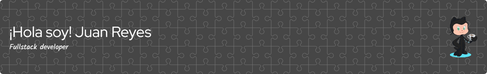

<h1 align="center">¡Hola! Soy Jhonrv 👋</h1>

  

  <a href="https://github.com/Jhonrv1998">
    

  Desarrollador Full-Stack 💻 | Amante del código limpio ✨ | Aprendiendo constantemente 📚

---

## 🚀 Tecnologías y Herramientas

---

## 🌟 Proyectos Destacados

- **[Encriptador de código](https://github.com/Jhonrv1998/EncriptadorDeCodigo)** - Breve descripción del proyecto.

---

## 📈 Estadísticas de GitHub

  

  

---

## 🤝 Conectemos

  
  

  

<!--
**Jhonrv1998/Jhonrv1998** is a ✨ _special_ ✨ repository because its `README.md` (this file) appears on your GitHub profile.

Here are some ideas to get you started:

- 🔭 I’m currently working on ...
- 🌱 I’m currently learning ...
- 👯 I’m looking to collaborate on ...
- 🤔 I’m looking for help with ...
- 💬 Ask me about ...
- 📫 How to reach me: ...
- 😄 Pronouns: ...
- ⚡ Fun fact: ...
-->
